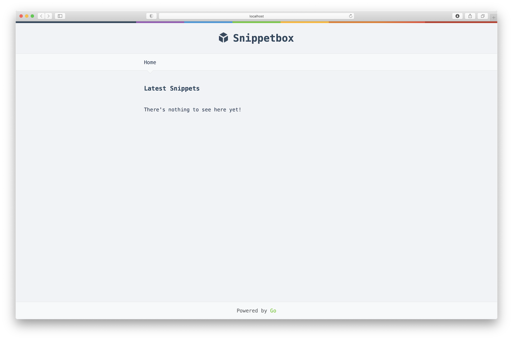

# About

A simple Go web application.

> Note:
>
> This repository is link to Docker Hub and is automatically build after `git push`

### To run the container using `docker container run`

```
 4:47:59 361  docker container run --name snippetbox -p 4000:4000 choonsiong/snippetbox
Unable to find image 'choonsiong/snippetbox:latest' locally
latest: Pulling from choonsiong/snippetbox
da7391352a9b: Already exists 
14428a6d4bcd: Already exists 
2c2d948710f2: Already exists 
732d84bc9610: Pull complete 
d920ed83a910: Pull complete 
7e4abbd28673: Pull complete 
78bc90a51009: Pull complete 
888ad530200e: Pull complete 
cfb5496f1177: Pull complete 
e42820fb090c: Pull complete 
6b95770397ea: Pull complete 
Digest: sha256:f39ffac7226dada503932ecaa8fc498a82bda869cc2f674f8f3a0115e073ed95
Status: Downloaded newer image for choonsiong/snippetbox:latest
2021/01/03 20:51:10 Starting server on :4000
```

